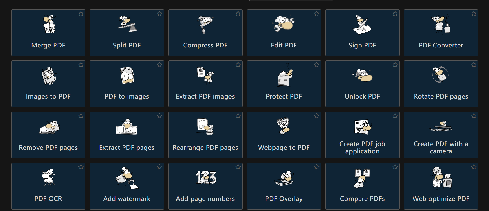
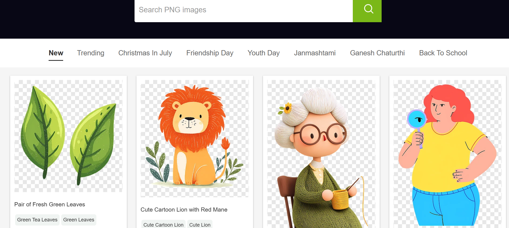
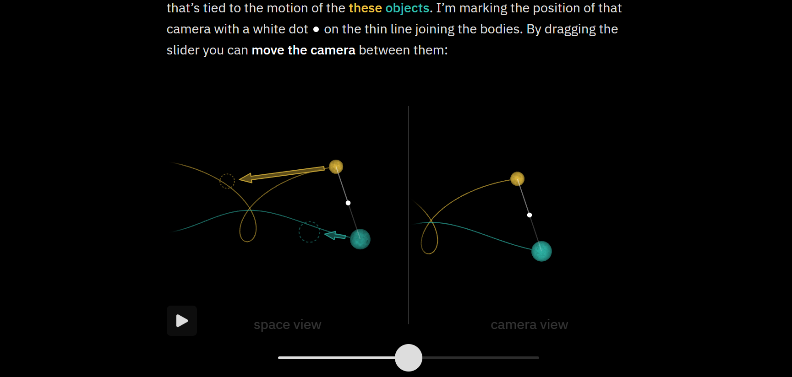
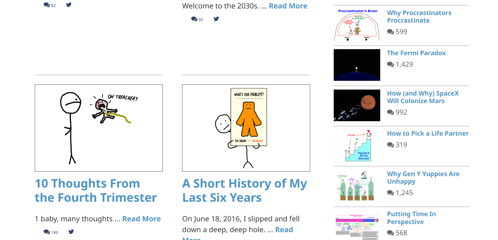
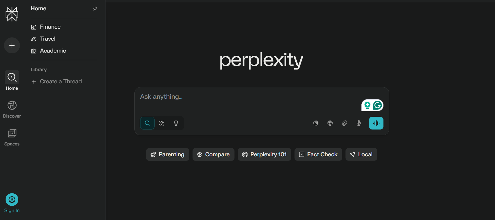
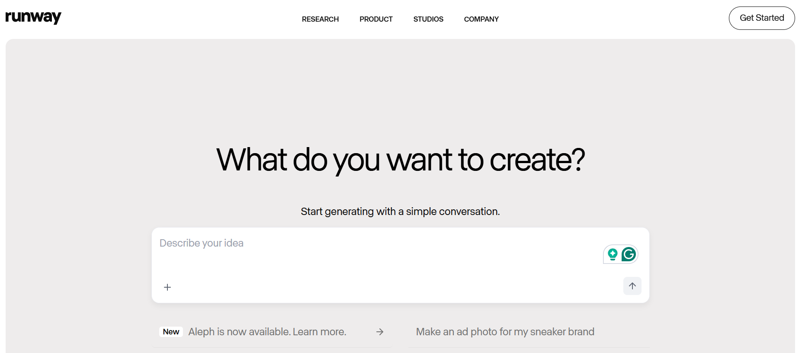
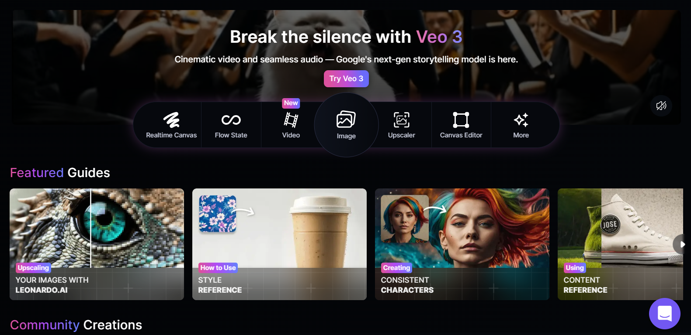
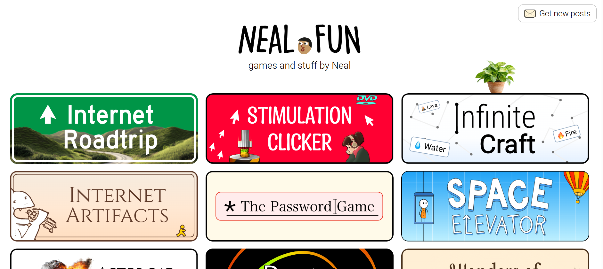

# 📅 Week 1 - 开刊号：效率神器、AI工具、深度阅读与趣味网站

> Curated on: 2025-08-04  
> 本期关键词：效率工具、AI神器、视觉化学习、趣味互动

---

## 功能型网站（效率提升 / 实用工具）

### 1. 🖼️ [Remove.bg](https://www.remove.bg)  
🎯 一键移除图片背景，适合设计、电商、自媒体用户。操作极其简单，上传即出图。

💬 **个人体验 / 使用建议**：_专注在移除图片背景，目前免费使用_

---

### 2. 📄 [PDF24 Tools](https://tools.pdf24.org)  
🎯 超全 PDF 工具集合，包括合并、压缩、编辑、加密、OCR 等功能。不限次数、无水印，界面简洁。

💬 **个人体验 / 使用建议**：_几乎包括所有压缩pdf 导出pdf 等等的功能，很有用，而且广告也比较少_

---

### 3. 🧼 [CleanPNG](https://www.cleanpng.com)  
🎯 免费透明背景 PNG 素材库，分类齐全、下载快速，适合 PPT、网页和产品图设计。

💬 **个人体验 / 使用建议**：_设计师或者有需要做海报的适合可以从这边找一找免费素材_

---

## 知识型网站（增长见识 / 系统学习）

### 4. 📐 [Explained From First Principles](https://ciechanow.ski)  
🎯 用互动动画解释复杂知识，如钟摆、引擎、信号处理等，深入浅出，兼具美感与逻辑性。

💬 **个人体验 / 使用建议**：_主要在讲解月亮和天体的运动，但是用来很多互动性动画，能都帮助视觉性的同学们快速学习_

---

### 5. 🧠 [Wait But Why](https://waitbutwhy.com)  
🎯 深度长文博客，涵盖 AI、人类心理、时间感知等，语言幽默，适合静下心来细品。

💬 **个人体验 / 使用建议**：_这个博客的作者上过TedTalk 讲题是：Inside the Mind of a Master Procrastinator | Tim Urban | TED
个人看过他的演讲 对他的表达方式很喜欢 很有趣 他的博客上也用了很可爱的小动画来讨论一些对生活很有帮助的话题_

---

## 🤖 AI型网站（内容创作 / 工作加速）

### 6. 🧐 [Perplexity AI](https://www.perplexity.ai)  
🎯 像 ChatGPT，但带引用来源。适合学生查资料、写论文找出处。

💬 **个人体验 / 使用建议**：_这个应该不陌生吧！不知道有谁完全用perplexity取代Google了吗 我还是用着Google居多，毕竟习惯还在_

---

### 7. 🎥 [Runway ML](https://runwayml.com)  
🎯 视频 AI 工具集合，包括去背景、换脸、文本生成视频等功能，非常适合内容创作者。

💬 **个人体验 / 使用建议**：_一样要先登入才能生成，至于画质其实也差不多，只是更专注在视频生成，所以对有需要的人可以更专心专注在视频上_

---

### 8. 🎨 [Leonardo.Ai](https://leonardo.ai)  
🎯 高质量图像生成平台，可训练风格、制作游戏角色、建筑图等，支持创意输出。

💬 **个人体验 / 使用建议**：_个人习惯让ChatGPT生成prompt后丢给它来生成，但是自从sora出来后就减少使用频率了_

---

## 🎮 游戏型网站（轻松互动 / 趣味体验）

### 9. 🕹️ [Neal.fun](https://neal.fun)  
🎯 一系列创意小游戏合集，像《深海之旅》《电车难题》《记忆画 logo》都值得一玩。

💬 **个人体验 / 使用建议**：_很多时间刺客，点进去玩的话很容易就不知不觉消耗掉很多时间
其中最喜欢的是“Who Was Alive？” 
可以收入年份看看历史中在那个年份还活着的人物有谁 还可以导去相对的 wikipedia
对于喜欢历史的我来说 很有意思_

---

### 10. 🥁 [线上太鼓达人](https://cjdgrevival.com/)  
🎯 太鼓达人网页版！键盘 `dk` 打边鼓，`fj` 打中心鼓，适合随时来一场节奏解压。

💬 **个人体验 / 使用建议**：_有些歌曲在游玩时接触不良，可能是个人技术不好，另外也会为我的键盘担心，但是真的可以不用去电玩城玩了，还是很有意思的_

---

## 🧾 本期总结

- 功能型：Remove.bg、PDF24、CleanPNG  
- 知识型：First Principles、Wait But Why  
- AI 工具：Perplexity、Runway、Leonardo  
- 趣味娱乐：Neal.fun、线上太鼓达人  

🔖 每个网站都是我亲自测试挑选，有些成为了我工作流程的常驻成员。  
下期我会带来更多冷门但实用的网站，欢迎留言推荐！

---

## 🙌 投稿建议 / Recommend a Site?

欢迎通过 Issue 或 PR 推荐你心中的“宝藏网站”：  
[👉 点这里打开投稿 Issue]([https://github.com/BlueSoul2003/weekly-sites-collection])

---

## 📸 图像资源说明

所有截图仅用于演示与介绍用途，版权归原网站所有。

