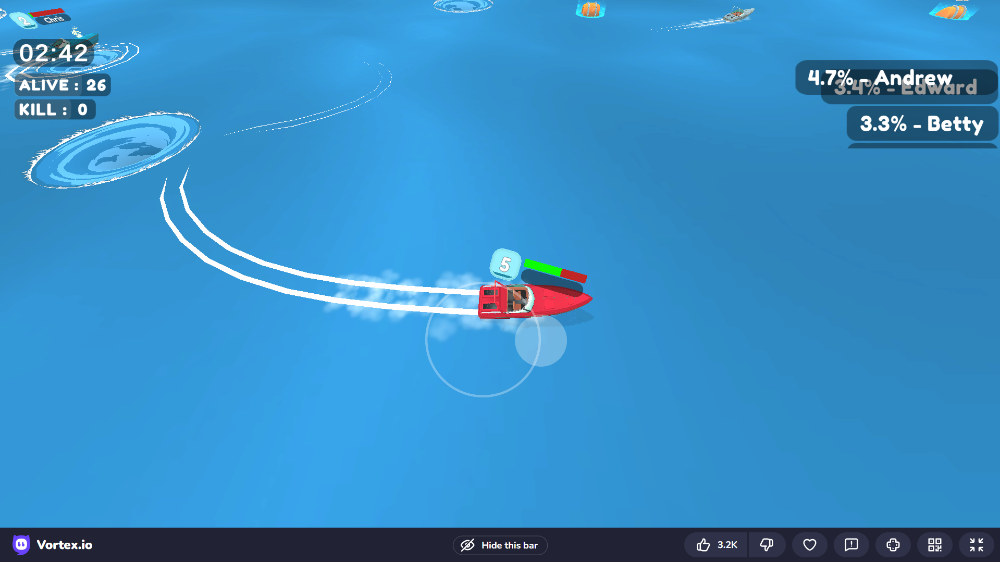
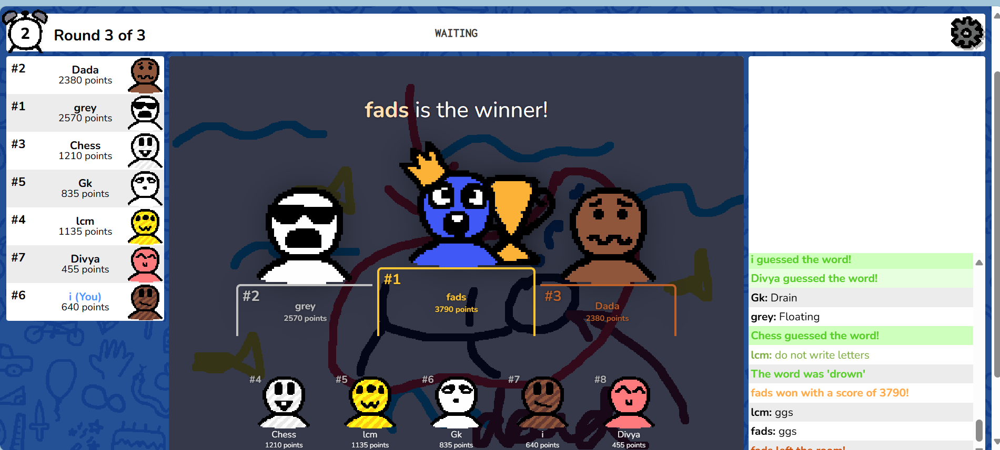
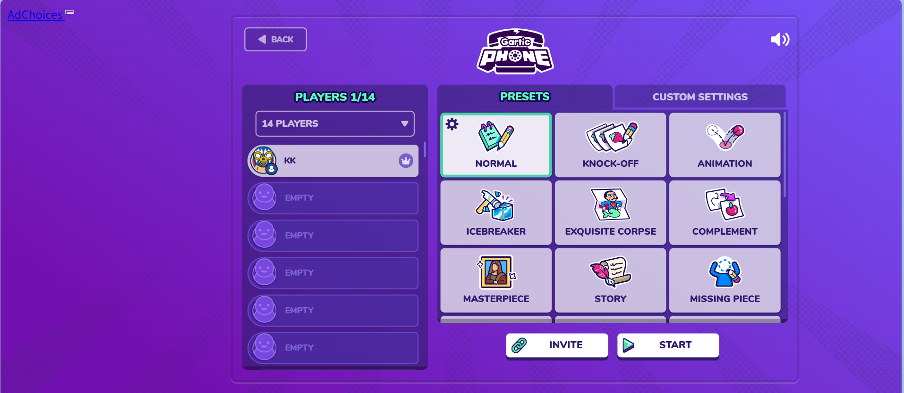
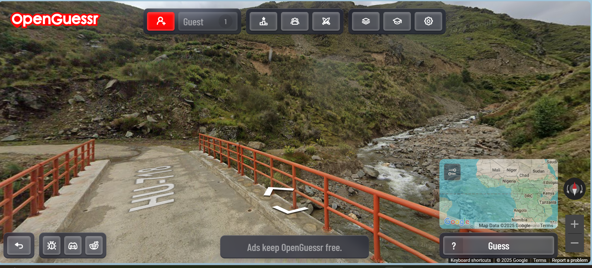
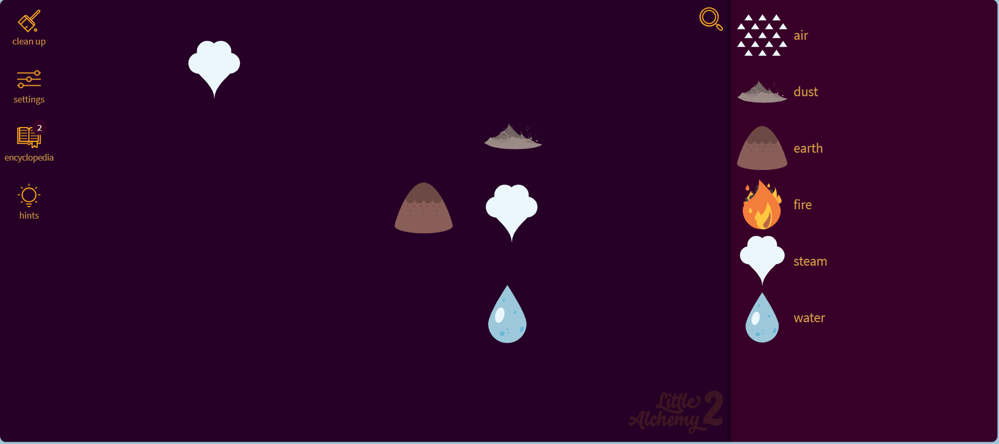
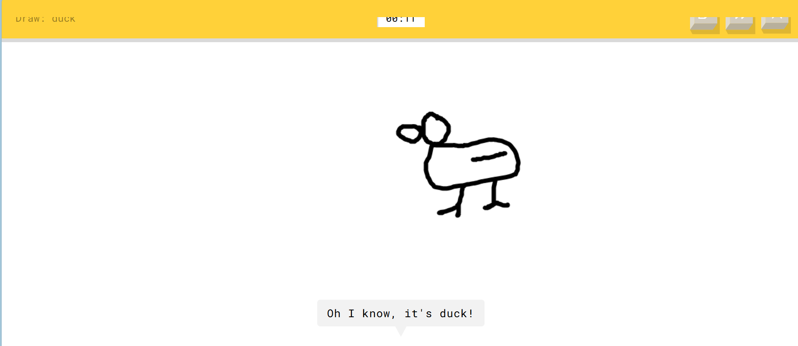
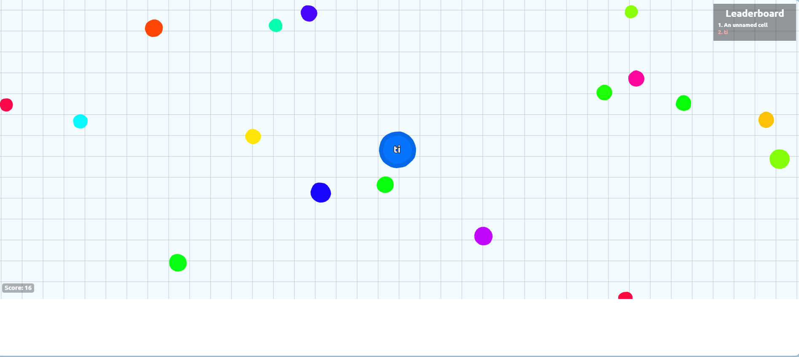
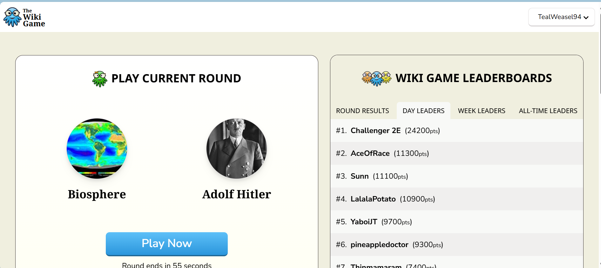
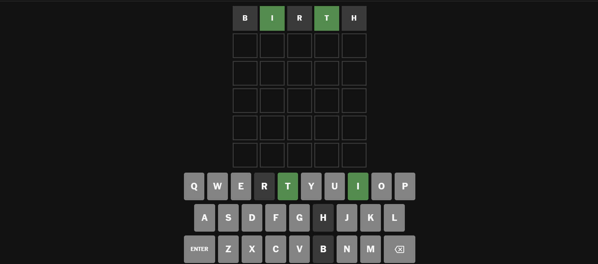

# 📅 Week 2 - 免费在线游戏推荐特辑 🎮

> Curated on: 2025-08-10  
> 本期主题：10 个免费在线游戏网站推荐，随时打开浏览器就能玩，零下载、零门槛。

---

## 🎮 免费在线游戏推荐

### 1. 🐍 [Slither.io](https://slither.io)
升级版的贪吃蛇，全球联机对战，吃光点变长，简单又上瘾。

💬 **个人体验 / 使用建议**：_很经典的io游戏 好几年前蛮火的，现在游玩人数还是有蛮多的_

---

### 2. 🌊 [Vortex.io](https://www.crazygames.com/game/vortex-io)
带旋涡的小艇战场游戏，在网页上即可操控小艇释放大漩涡吞没对手。

💬 **个人体验 / 使用建议**：_对手都很喜欢互相对撞，其实双方都会掉血，最后剩下一滴血才珍惜_

---

### 3. ✏️ [Skribbl.io](https://skribbl.io)
你画我猜多人在线游戏，可和朋友实时开房互动，既创意又好玩。

💬 **个人体验 / 使用建议**：_会有不一样的人随时进来，随机性很强_

---

### 4. 🎨 [Gartic Phone](https://garticphone.com)
趣味“传画猜画”模式，先画再猜，笑点百出，聚会娱乐首选。

💬 **个人体验 / 使用建议**：_要和朋友约才能一起玩，适合不能线上聚会_

---

### 5. 🌍 [OpenGuessr](https://openguessr.com/)
免费的 GeoGuessr 替代品，通过街景图猜地点，支持单人、多人与主题挑战模式，社区地图丰富，全球竞赛氛围浓。

💬 **个人体验 / 使用建议**：_对我来说真的好难啊啊，地图盲_

---

### 6. 🔥 [Little Alchemy 2](https://littlealchemy2.com)
从空气、水、火开始，通过组合探索数百种元素，创作感十足。

💬 **个人体验 / 使用建议**：_自己像炼金术师一样，很多组合都很意想不到_

---

### 7. ⏳ [Quick, Draw!](https://quickdraw.withgoogle.com)
Google AI 猜画游戏，限时 20 秒画画挑战，考验反应与表达能力。

💬 **个人体验 / 使用建议**：_如果嫌和真人玩太蠢，和AI玩好像也不错！_

---

### 8. ⚪ [Agar.io](https://agar.io)
大球吃小球经典在线竞技，玩法简单却极度上瘾。

💬 **个人体验 / 使用建议**：_没什么人玩，适合佛系玩家_

---

### 9. 📚 [The Wiki Game](https://www.thewikigame.com)
从一个维基词条跳转到另一个目标词条，用最少点击完成挑战，考验知识与逻辑。

💬 **个人体验 / 使用建议**：_这个超棒的，很考验逻辑_

---

### 10. 🔠 [Wordle](https://www.nytimes.com/games/wordle)
每日一个五字母单词猜谜游戏，全球同服竞技，社交晒战绩必备。

💬 **个人体验 / 使用建议**：_对英文不好的我来说真的要思考很久啊_

---

## 🧾 本期总结
- 休闲放松类：Slither.io、Agar.io、Little Alchemy 2
- 朋友聚会类：Skribbl.io、Gartic Phone
- 知识挑战类：OpenGuessr、The Wiki Game、Wordle
- 反应创意类：Quick, Draw!、Vortex.io

🔖 这些游戏不仅免费，还能随时用浏览器打开，非常适合打发时间、与朋友连线或独自挑战。

---

## 🙌 投稿建议 / Recommend a Game?
欢迎通过 Issue 推荐你心中的“宝藏在线游戏”：  
[👉 点这里打开投稿 Issue](https://github.com/BlueSoul2003/weekly-sites-collection/issues)

---
