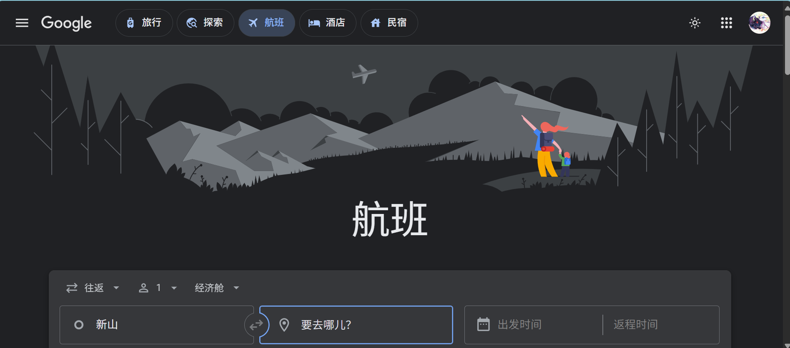
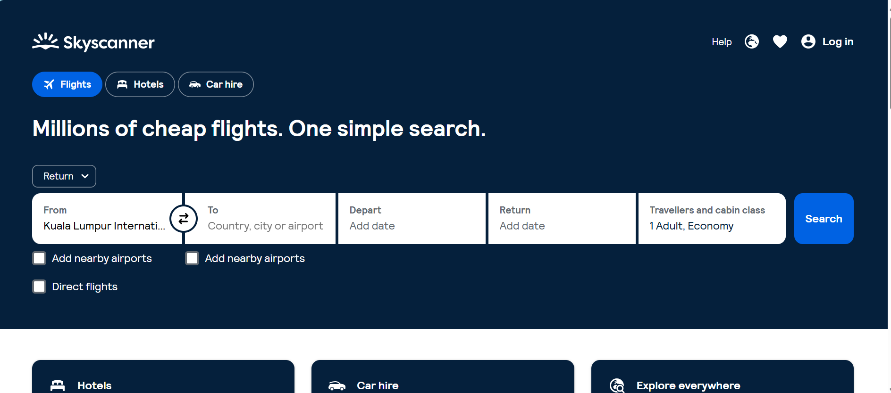
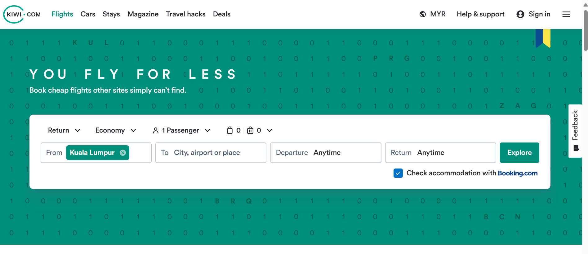
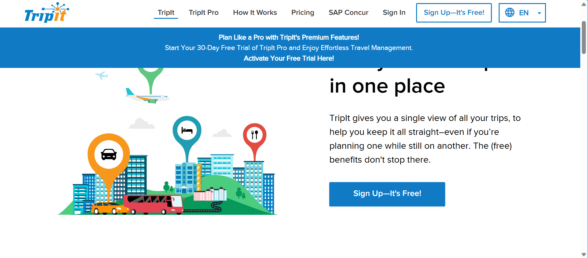
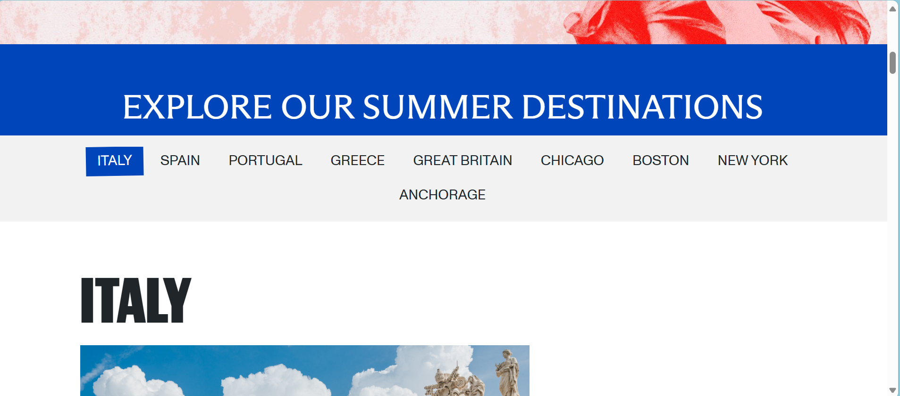
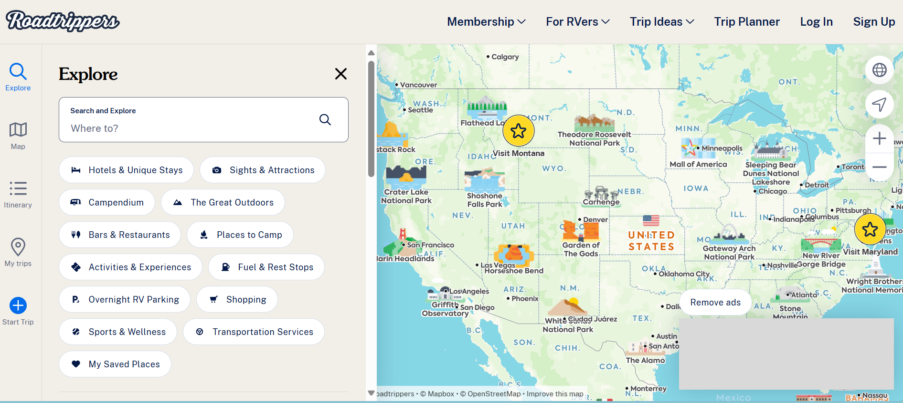
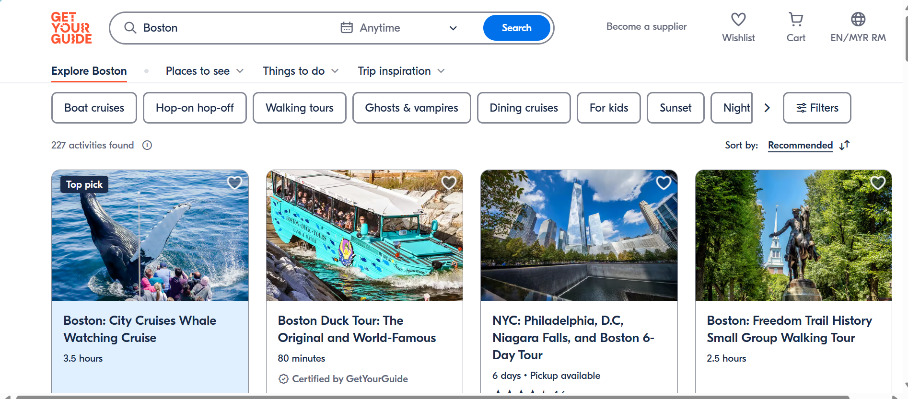
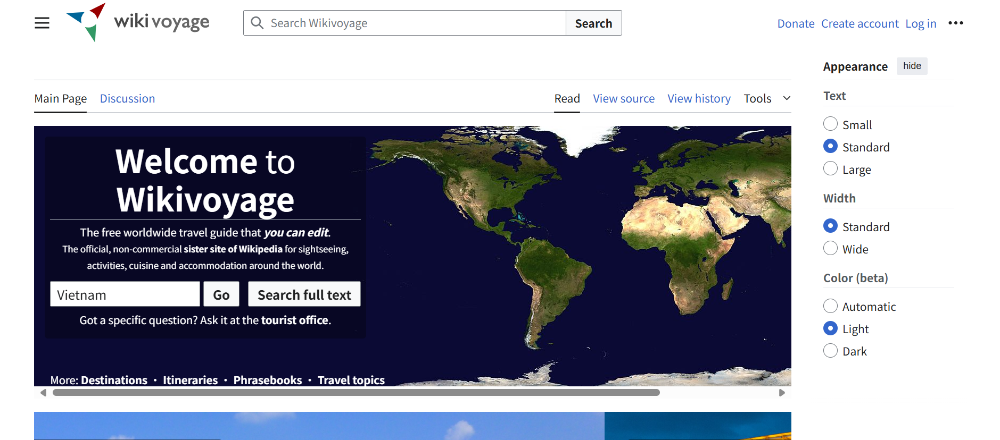
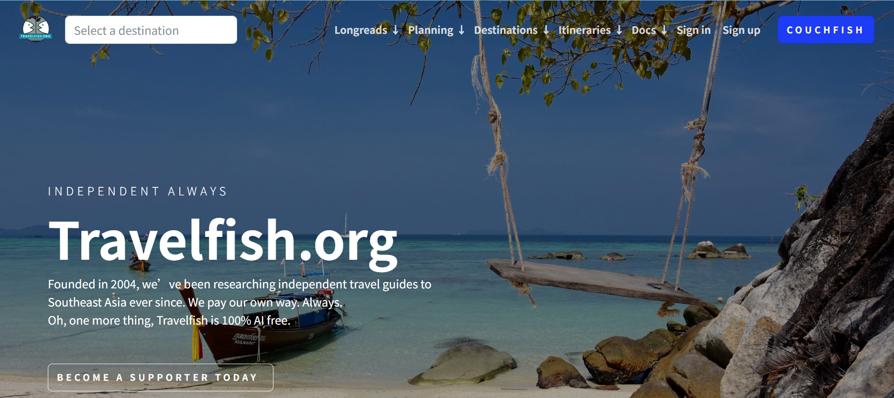

# 📅 Week 3 - 实用旅行网站推荐 ✈️

> Curated on: 2025-08-17  
> 本期主题：10 个超实用旅行工具与资源网站，帮你从订票到行程管理全方位提升旅行体验。

---

## 🌍 实用旅行网站推荐

### 1. ✈️ [Google Flights](https://www.google.com/flights)  
高效机票比价与价格追踪工具，可查看历史趋势并设置提醒。

💬 **个人体验 / 使用建议**：_很全能 第一推荐_

---

### 2. 🧳 [Skyscanner](https://www.skyscanner.net)  
集机票、酒店、租车比较于一体，支持全月日期查询与价格提醒。

💬 **个人体验 / 使用建议**：_我喜欢他的界面设计_

---

### 3. 🌐 [Kiwi.com](https://www.kiwi.com/)  
借助“虚拟联程”算法整合不同交通方式，提供多城市联程及省钱方案（如 Nomad、多种 Travel Hacks）。

💬 **个人体验 / 使用建议**：_用它来买飞机票可以节省很多哦_

---

### 4. 📅 [TripIt](https://www.tripit.com/web)  
自动生成行程表并提供实时提醒，是旅行邮件整理与行程管理利器。

💬 **个人体验 / 使用建议**：_如果想要好好规划旅程，可以用这个网站_

---

### 5. 🌏 [Lonely Planet](https://www.lonelyplanet.com/)  
广泛覆盖目的地指南与旅行灵感，由经验丰富的旅行者提供实用建议。

💬 **个人体验 / 使用建议**：_如果想要自己的旅途和别人不一样，可以试试这个_

---

### 6. 🚗 [Roadtrippers](https://roadtrippers.com/)  
专注美加公路旅行，提供沿途景点、住宿、费用估算，并支持同步至移动导航。

💬 **个人体验 / 使用建议**：_驾着车 一路旅游一直都是我的梦想，这边也有很多可以借鉴的地方_

---

### 7. 🎟️ [GetYourGuide](https://www.getyourguide.com/)  
可预订全球旅游活动与景点门票，行程安排更丰富。

💬 **个人体验 / 使用建议**：_这个定票真的很全面_

---

### 8. 📖 [Wikivoyage](https://en.wikivoyage.org/)  
一个由旅者维护的免费旅行指南网站，涵盖目的地、行程、饮食、住宿等实用信息。

💬 **个人体验 / 使用建议**：_比起找Google 可以直接从这里开始_

---

### 9. 🌴 [Travelfish](https://travelfish.org/)  
专注东南亚地区的深度旅游指南，内容详实，适合自由行爱好者。

💬 **个人体验 / 使用建议**：_非常适合低成本旅游_

---

### 10. 🚆 [Seat61](https://www.seat61.com/)  
英国铁路旅行指南专家，详细覆盖欧洲、印度、俄罗斯等地的火车与渡轮路线。

💬 **个人体验 / 使用建议**：_没有确切使用过，但是看到内容真的很niche 很足_

---

## 🧾 本期总结
- **机票比价与订票**：Google Flights、Skyscanner、Kiwi.com  
- **行程管理**：TripIt  
- **目的地灵感**：Lonely Planet、Wikivoyage、Travelfish  
- **特色旅行方式**：Roadtrippers（自驾）、Seat61（火车旅行）  
- **活动预订**：GetYourGuide  

🔖 这些网站几乎覆盖了旅行全流程，无论是背包客、深度游还是轻松度假，都能找到合适的工具。

---

## 🙌 投稿建议 / Recommend a Travel Site?
欢迎通过 Issue 推荐你心中的“旅行神器”：  
[👉 点这里打开投稿 Issue](https://github.com/BlueSoul2003/weekly-sites-collection/issues)

---
