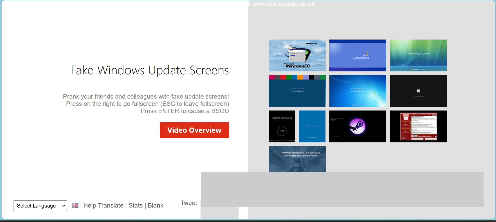
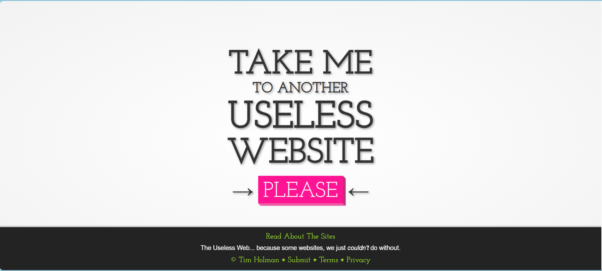
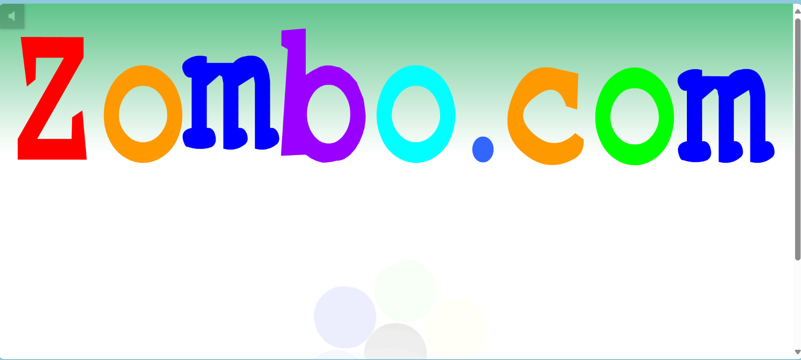
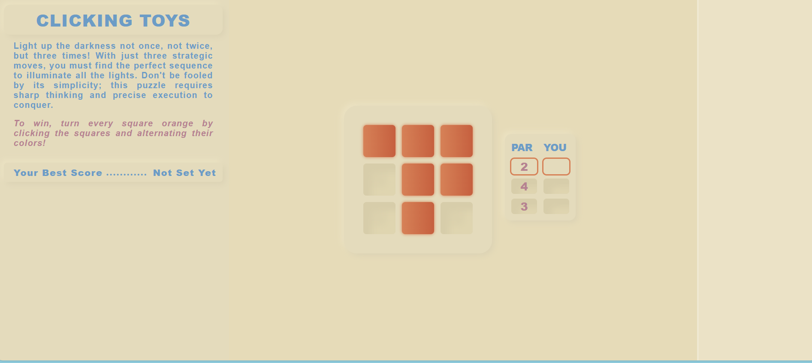
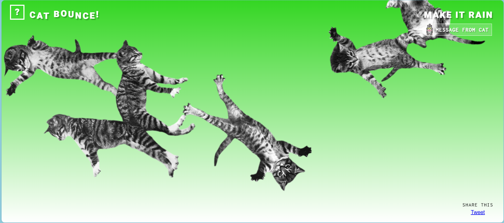
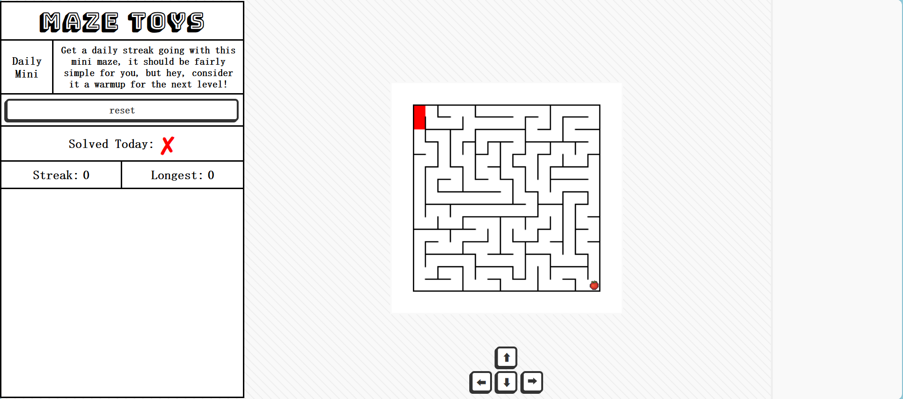
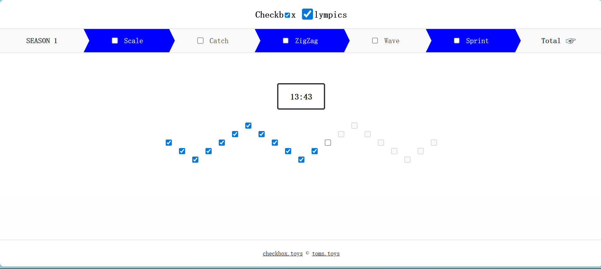
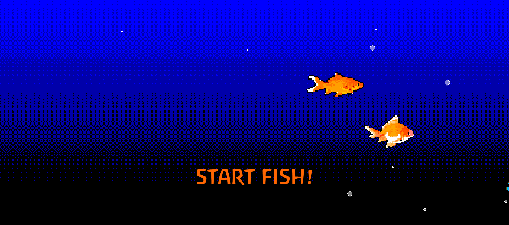
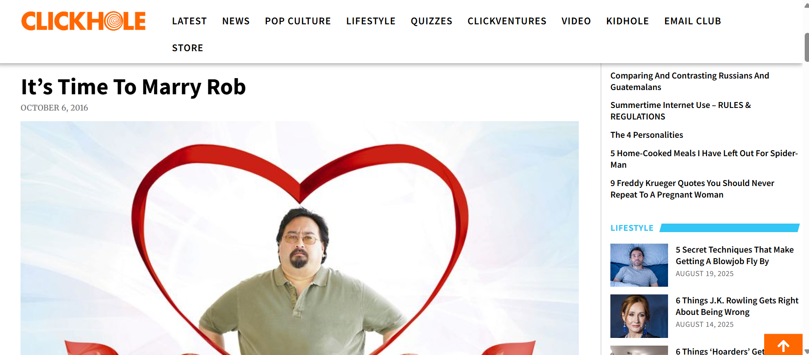

# 📅 Week 4 - 10 个“摸鱼神器”网站推荐 🎭

> Curated on: 2025-08-26  
> 本期主题：打工摸鱼必备！10 个无聊但魔性的网页，让你短暂放松、假装忙碌或单纯浪费时间。

---

## 🎭 摸鱼神器网站推荐

### 1. 💻 [FakeUpdate.net](https://fakeupdate.net)  
模拟 Windows 系统更新界面，让人误以为电脑正在更新，适合拖延或装忙。

💬 **个人体验 / 使用建议**：_打工摸鱼神器！_

---

### 2. 🔀 [The Useless Web](https://theuselessweb.com)  
点击按钮，随机进入各种无厘头小网站，纯粹浪费时间但非常解压。

💬 **个人体验 / 使用建议**：_这10个里面最喜欢的，很随机带你去到好玩的网站_

---

### 3. 👉 [Pointer Pointer](https://pointerpointer.com)  
你的鼠标在哪里，页面就会出现一张有人指向那个位置的照片，诡异但魔性。

💬 **个人体验 / 使用建议**：_建议不要半夜一个人点开，莫名的越玩越毛_

---

### 4. 🌀 [Zombo.com](https://www.zombo.com)  
无限循环的“欢迎来到 Zombo.com”，没有下一页，经典摸鱼站点。

💬 **个人体验 / 使用建议**：_很废_

---

### 5. 🎮 [Clicking Toys – Flip Grid](https://clicking.toys/flip-grid/neat-nine/3-holes/)  
一个超简洁的点击小游戏，通过翻格子打发时间，像素感十足。

💬 **个人体验 / 使用建议**：_很简洁，但是我玩到抓狂_

---

### 6. 🐱 [Cat Bounce](https://cat-bounce.com)  
屏幕上跳来跳去的小猫咪，还可以用鼠标拨动，非常可爱治愈。

💬 **个人体验 / 使用建议**：_可爱的猫猫一直在跳_

---

### 7. 🧩 [Maze Toys – Daily Mini Maze](https://maze.toys/mazes/mini/daily/)  
每天一副小迷宫，随机生成，适合短暂放松，锻炼一点点逻辑力。

💬 **个人体验 / 使用建议**：_这个我超强的，最快15秒！_

---

### 8. ☑️ [Checkbox Toys – Zigzag](https://checkbox.toys/zigzag/)  
利用复选框玩出奇怪的小游戏，看似无聊却很容易沉迷。

💬 **个人体验 / 使用建议**：_就是一直点checkbox，但也很好玩_

---

### 9. 🐟 [Mackerelmedia Fish](http://mackerelmediafish.com)  
怀旧风格的 ARG 式网页探险，让人仿佛回到 90 年代的互联网。

💬 **个人体验 / 使用建议**：_感觉回到以前网站很多bug的那个年代_

---

### 10. 📰 [ClickHole](https://clickhole.com)  
荒诞的讽刺新闻与点击诱饵式段子，轻松解压又能一笑。

💬 **个人体验 / 使用建议**：_点进去看起来是很正常的blog，但是他的文章全都没有一个正常的_

---

## 🧾 本期总结
- **装忙神器**：FakeUpdate、Zombo.com  
- **无聊解压**：The Useless Web、Pointer Pointer、Cat Bounce  
- **小游戏**：Flip Grid、Mini Maze、Zigzag  
- **脑洞探索**：Mackerelmedia Fish、ClickHole  

🔖 摸鱼不是目的，放松才是核心。希望这些小站能帮你在学习或工作间隙找到片刻乐趣。

---

## 🙌 投稿建议 / Recommend a Site?
欢迎通过 Issue 推荐你心中的“摸鱼神器”：  
[👉 点这里打开投稿 Issue](https://github.com/BlueSoul2003/weekly-sites-collection/issues)

---
