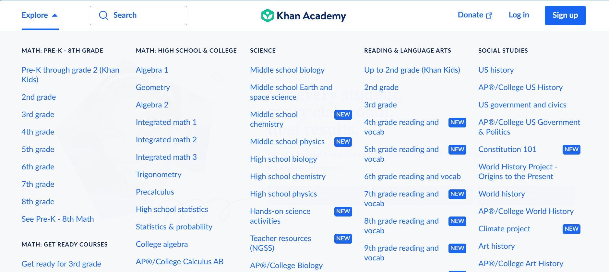
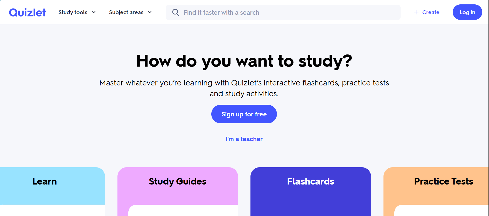
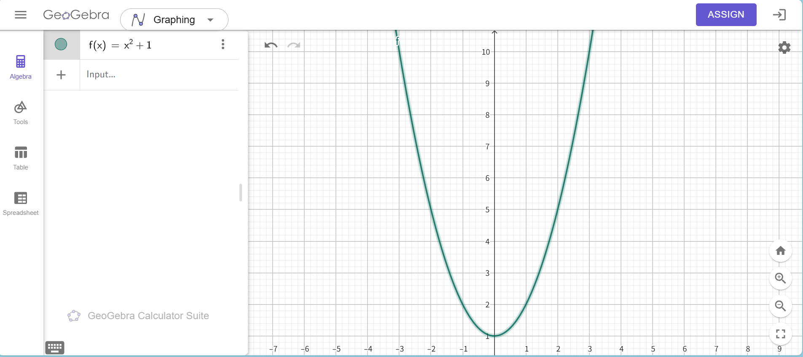
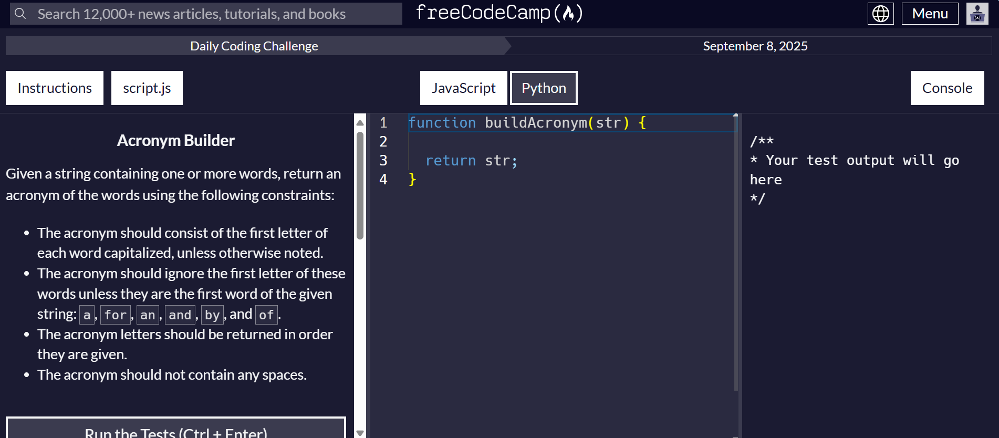
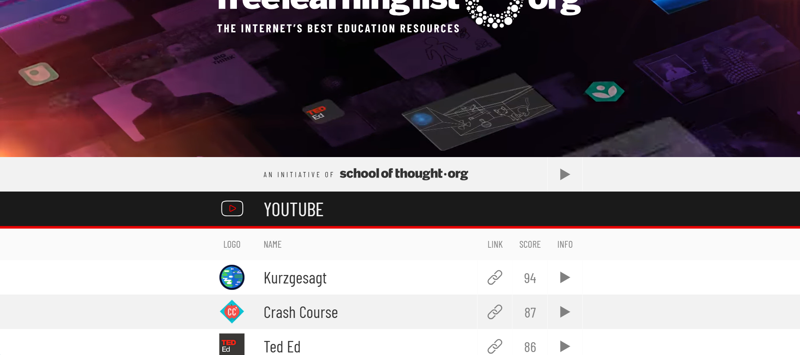
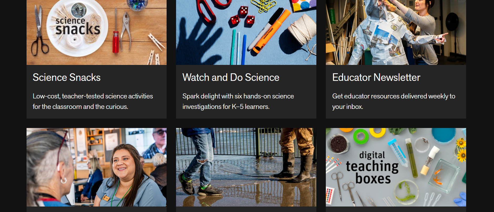
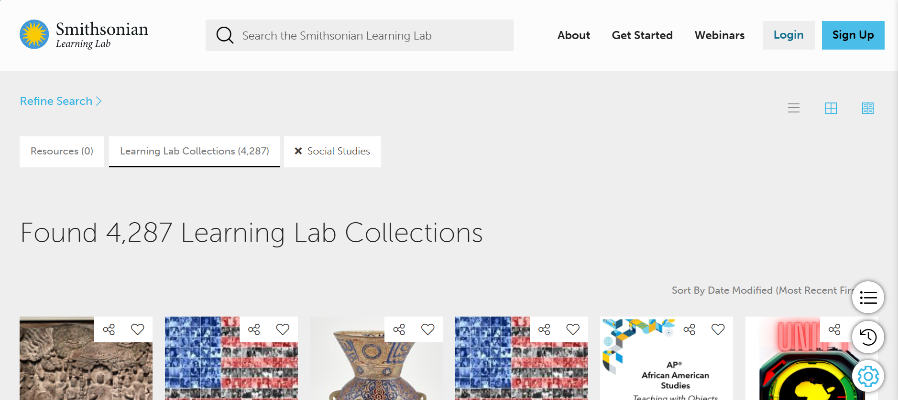
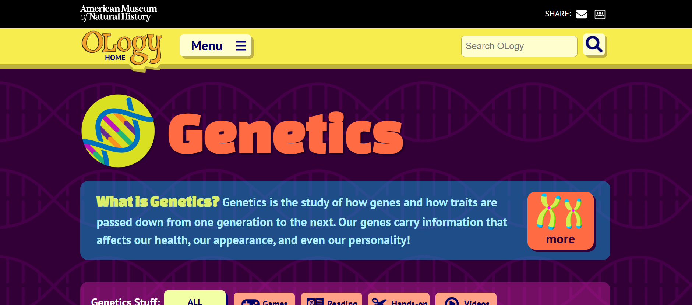
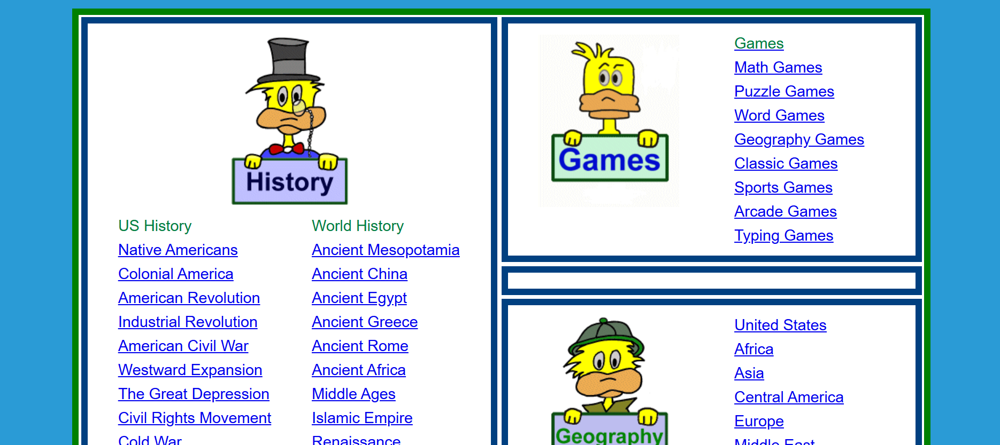
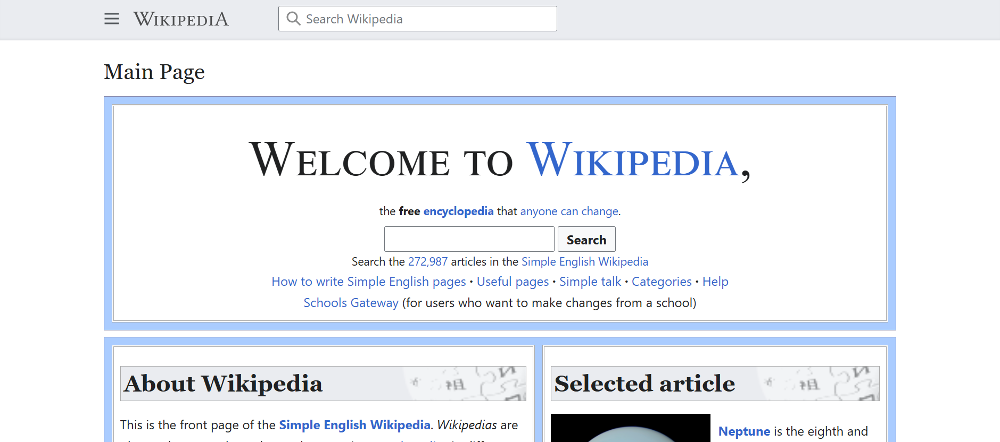

# 📅 Week 5 - 学习提升类网站推荐 📚

> Curated on: 2025-09-8  
> 本期主题：10 个免费又实用的学习资源网站，涵盖课程、工具、知识库，助你高效提升。

---

## 📚 学习提升类网站推荐

### 1. 🎓 [Khan Academy](https://www.khanacademy.org/)  
全球知名的公益学习平台，涵盖数学、科学、编程、历史等，支持互动练习与个性化学习路径。

💬 **个人体验 / 使用建议**：_最全面，权威和免费的学习网站_

---

### 2. 📝 [Quizlet](https://quizlet.com/)  
制作和分享学习卡片的工具，适合记单词、背公式，支持测试、游戏化学习。

💬 **个人体验 / 使用建议**：_简单的学习卡片制作可以，没有必要付费_

---

### 3. 📐 [GeoGebra](https://www.geogebra.org/)  
强大的数学交互工具，支持几何、代数、统计和微积分的可视化。

💬 **个人体验 / 使用建议**：_理科生应该没有不知道它的，函数图像化真的很有帮助_

---

### 4. 💻 [freeCodeCamp](https://www.freecodecamp.org/)  
开放的编程学习社区，通过实战项目学习 Web 开发、数据分析、机器学习等。

💬 **个人体验 / 使用建议**：_难得有这样免费的coding 学习，但是免费的总会让人不珍惜_

---

### 5. 📂 [The Free Learning List](https://freelearninglist.org/)  
收录全球免费的学习资源，包括课程、播客、书籍，按主题分类，简单易查。

💬 **个人体验 / 使用建议**：_我用它发现到很多宝藏YouTube channel，很有帮助！_

---

### 6. 🎥 [PBS Learning Media](https://www.pbslearningmedia.org/)  
美国 PBS 提供的免费课程视频与教材，涵盖科学、社会学、艺术等。

💬 **个人体验 / 使用建议**：_学校类的资料比较多_

---

### 7. 🏛️ [Smithsonian Learning Lab](https://learninglab.si.edu/)  
史密森学会提供的教育平台，包含海量博物馆藏品与互动学习资源。

💬 **个人体验 / 使用建议**：_我太喜欢这个了！有一种当考古学家做研究的感觉_

---

### 8. 🔬 [Ology (Science for Kids)](https://www.amnh.org/explore/ology)  
纽约自然历史博物馆的科普网站，专为孩子设计，轻松探索科学知识。

💬 **个人体验 / 使用建议**：_很可爱，不只适合小朋友，也适合想要开拓新视野_

---

### 9. 🦖 [Ducksters](https://www.ducksters.com/)  
面向青少年和孩子的教育网站，涵盖历史、科学、地理、人物等，通俗易懂。

💬 **个人体验 / 使用建议**：_分类很清楚_

---

### 10. 📖 [Simple English Wikipedia](https://simple.m.wikipedia.org/wiki/Main_Page)  
维基百科的简明版，用更简单的英语解释知识点，非常适合英语学习者。

💬 **个人体验 / 使用建议**：_有好奇心但英文又不是很好，每次看英文版的wiki都会头晕的话就可以先从这边开始_

---

## 🧾 本期总结
- **综合学习**：Khan Academy、The Free Learning List  
- **工具辅助**：Quizlet、GeoGebra  
- **编程进阶**：freeCodeCamp  
- **视频与教材**：PBS Learning Media、Smithsonian Learning Lab  
- **青少年资源**：Ology、Ducksters  
- **语言学习**：Simple English Wikipedia  

🔖 无论你是学生、教师还是自学者，这些平台都能帮你更高效地学习与探索。

---

## 🙌 投稿建议 / Recommend a Site?
欢迎通过 Issue 推荐你心中的“学习神器”：  
[👉 点这里打开投稿 Issue](https://github.com/BlueSoul2003/weekly-sites-collection/issues)

---
